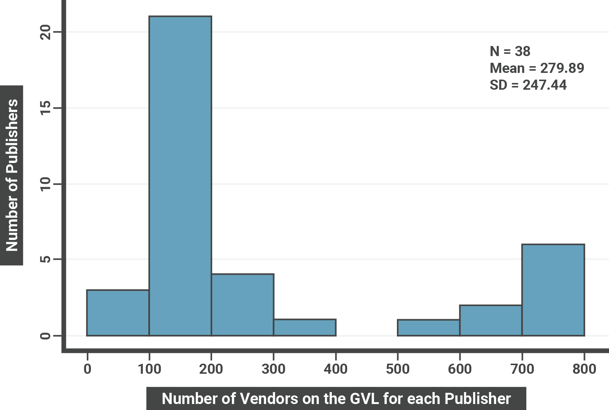
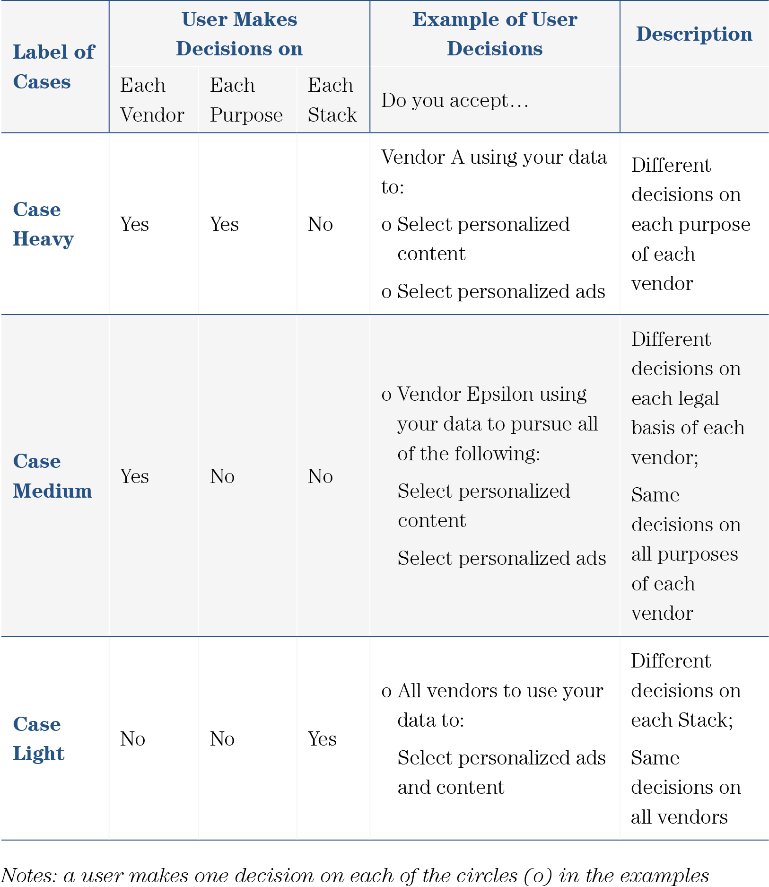
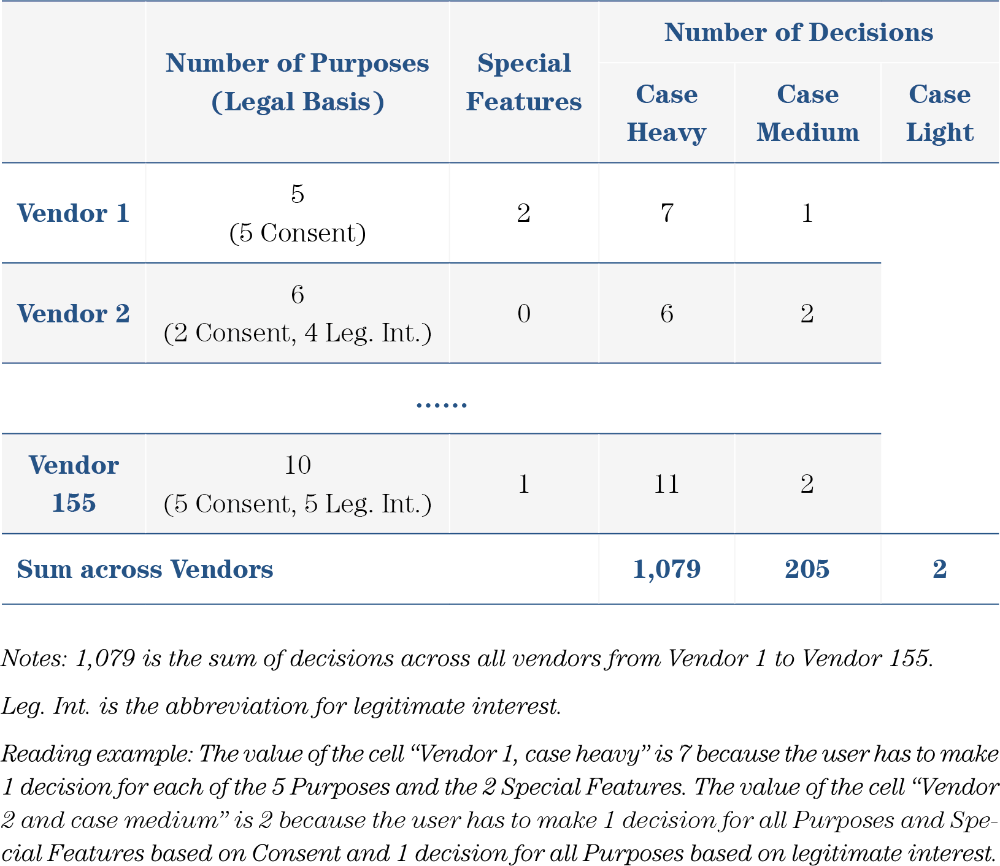
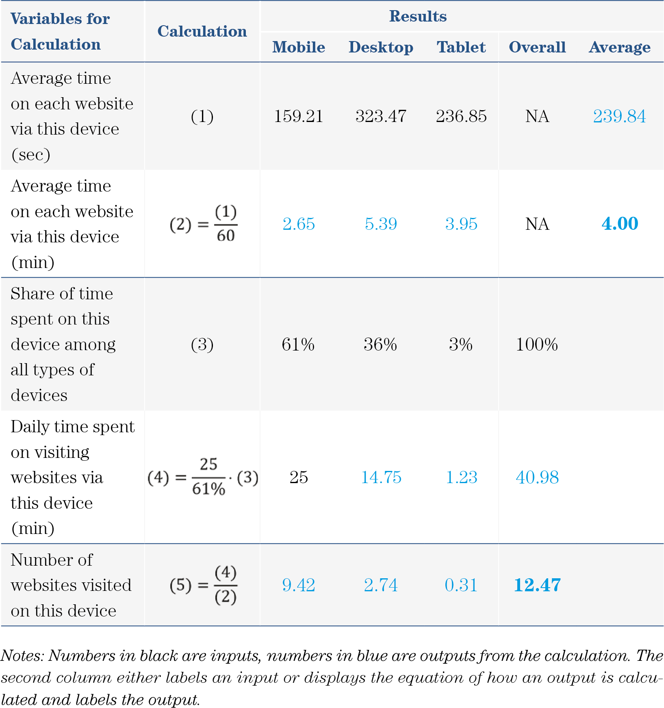
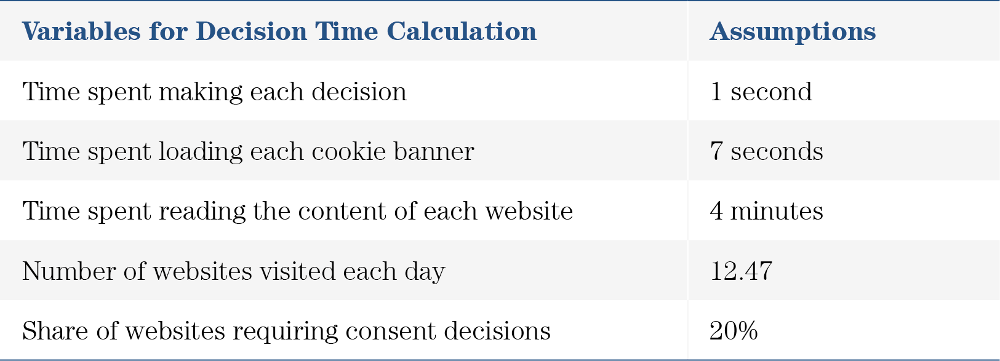
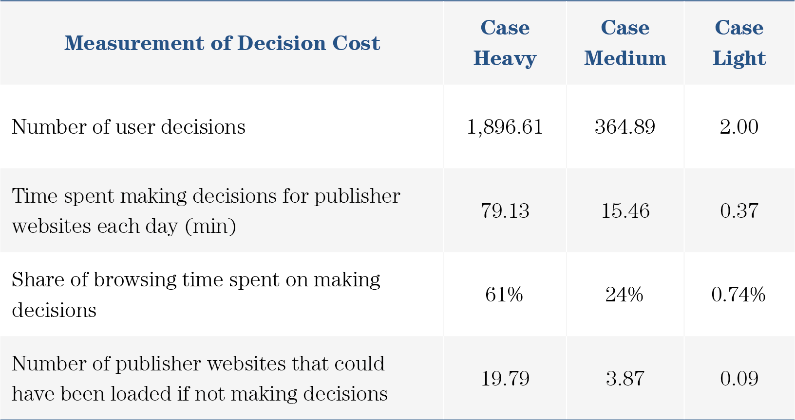

# Empirical Examination of the Complexity of Getting Permission for Data Processing

## Aim of the Empirical Study

Section 6 described the challenges for publishers and vendors in every step of getting permission for data processing towards supplying a legal basis in compliance with the GDPR.
Although the TCF was designed to mitigate these challenges---by creating purpose specifications, tools, and rules---the procedures of getting permission are still complicated.
Notably, firms' requirement to get permission for data processing imposes complexity not only on the firms themselves but also on users, who must handle cookie banners on numerous websites.
Indeed, as elaborated in Section 6.2, only a few tools are available that support users in giving permission.
In this section, we attempt to empirically quantify how complicated the process is regarding the amount of effort that firms and users have to invest in getting and providing permission, respectively.
Such an assessment can point to directions that policymakers and actors in the online advertising market should focus on to facilitate the implementation of the GDPR, or to design new regulations.

We build our empirical analysis on the TCF, both because it is a prominent standard in the online advertising industry, and because it provides access to a great deal of publicly available information (e.g., GVL).
For example, reliance on the TCF enables us to incorporate metrics such as the number of purposes each publisher and vendor pursues.

We divide our analysis into two parts.
First, we focus on firms operating in the online advertising industry, evaluating the complexity of handling and checking permission---as reflected in the level of interconnectedness among firms.
Second, we focus on users, examining the decision costs when giving and denying permission.

## Data collection and Description

To empirically analyze the process of getting permission for data processing, we sought to obtain data on (i) publishers that request user data, (ii) the vendors that each publisher collaborates with, and (iii) the purposes each vendor pursues.
Accordingly, we combined two datasets, which we refer to as (1) a publisher--vendor (PV) dataset, and (2) a Global Vendor List (GVL) dataset.

The PV dataset is a list of publishers and of the vendors with whom they collaborate.
Specifically, we focus on the 38 publishers among the Top 100 publishers in Germany (SimilarWeb web traffic ranking, December 2020) that use the TCF.
To collect data about these publishers, we used a tool called "Consent Management Platform (CMP) Validator".
The CMP Validator, which is a browser extension for Google Chrome, was developed by IAB Europe to check the validity of CMPs that register with the TCF.
In practice, when one clicks on the extension from a publisher's webpage, a user interface pops up, as displayed in Figure 21.
This user interface presents a list of the vendors with which the publisher collaborates, and it describes which legal bases each vendor uses to support its purposes on that publisher's webpage.
It also outlines the TCF purposes and Special Features pursued by the publisher (on its own behalf and on behalf of its vendors) for each legal basis.
We recorded all this information for each of our 38 publishers.
Note that a publisher can also work with vendors who are not on the GVL, and these vendors do not appear on the list from the user interface.

{width="634"}

The CMP Validator does not specify the purposes pursued by each vendor.
To obtain this information, we used the GVL dataset; see Sections 7.4.1.1 and 7.5.1 for information on what the GVL is and how it works to centralize vendors' permission requests.
We obtained these data from the official website of the GVL (see www.iabeurope.eu/vendor-list; the website is updated every week, and IAB Europe also provides data via JSON files).
The GVL dataset was based on the October 14, 2021 version of the GVL.
This version of the GVL contained 803 vendors.
Note that an increasing number of vendors have been getting on GVL since TCF 2.0 took effect.
Figure 22 depicts the increase in the number of vendors on the GVL (Sep 2019 -- Oct 2021).
For each of the 803 vendors in the GVL dataset, we recorded the TCF purposes it pursues and the corresponding legal bases that support the TCF purposes.

{width="569"}

## Examining the Complexity of Getting Permission for Actors in the Online Advertising Industry

### Measurement of Complexity: Interconnectedness

In the first part of the analysis, we sought to measure the complexity that publishers face in getting permission for data processing (i.e., the amount of effort they must invest).
To measure complexity, we evaluated the extent to which each of the 38 publishers in our PV dataset is interconnected with partner vendors.
We operationalized interconnectedness as the number of vendors on the GVL that each publisher collaborates with, as indicated by the PV dataset.
We focused on this measure because vendors rely on publishers to get permission on their behalf.
Each publisher-vendor collaboration requires a separate process of collecting, storing, and checking user permission before sharing any personal data.
Thus, the more vendors a publisher collaborates with, the more complexity it faces in getting permission.
Note that there may be vendors that a publisher collaborates with that are not in the GVL hence not included in the PV dataset.
Therefore, our measure might underestimate the complexity.

### Description of Results

Figure 23 shows a histogram of the number of vendors on the GVL for each publisher in the PV dataset.
On average, each publisher collaborates with 279.89 vendors.
In other words, if a new user visits a publisher, then, on average, the publisher has to collect and store the user's permission for data processing on behalf of 279.89 vendors.

{width="599"}

This finding suggests that publishers in the advertising industry have extensive interconnections with partner vendors, such that the process of getting permission for data processing is highly complex.
One visit from a new user to a publisher triggers permission requests corresponding to hundreds of vendors, followed by storage of information and data transfers.
Note that there are still cases where publishers display the full GVL even though they do not collaborate with all registered vendors because they have not filtered out vendors with whom they are not actually working.
Therefore, we might overestimate the complexity in these cases.

## Examining the Complexity that Users Face in Making Decisions about Permission

### Measurement of Complexity: Decision Costs

To measure the complexity users face as a result of firms' process of getting permission for data processing, we sought to calculate the decision costs of users when determining whether to give permission.
The EU's guidelines (WP259) with regard to interpreting the GDPR's regulations on consent point out that granularity is one requirement for valid user permission; specifically, a user must have the chance to make different decisions on permission for each purpose of each vendor (European Data Protection Board 2020).
However, regardless of whether a user gives permission or not, making decisions is costly in terms of effort and time, as the user is required, e.g., to read and process information.

To capture a user's decision costs, we used the number of decisions a user has to make on an average day when visiting an average number of websites, as well as the amount of time required to make these decisions.

We estimated the decision costs for users for the following three scenarios: In the first scenario, a user makes one decision for each purpose of each vendor (Case Heavy); this scenario captures a theoretical upper-bound estimate of the highest decision cost possible under the GDPR.
In the second scenario, a user makes one decision for each vendor (Case Medium), regardless of the specific TCF purposes a vendor pursues; this scenario reflects the level of granularity that cookie banners typically offer in practice.
In the third scenario, a user makes one decision for each TCF Stack, where a Stack is a pre-defined set of TCF purposes or Special Features (Case Light; see Section 7.3.3 for further details on Stacks); this scenario reflects a situation in which users make granular decisions while incurring the lowest possible decision costs.
Consideration of these three scenarios enables us to obtain a comprehensive estimate of the decision costs that users with different preferences for decision granularity are likely to incur in practice.
The three scenarios also enable us to capture the heterogeneity of publishers' purpose specifications and cookie banner designs.
Table 16 shows examples of user decisions in the three scenarios.

{width="630"}

For each scenario, we used the PV dataset (which specifies publisher--vendor collaborations) together with the GVL dataset (which specifies the purposes that each vendor pursues) to estimate the number of decisions a user must make when visiting a given publisher for the first time.

Table 17 provides an example of how to calculate the number of user decisions for Case Heavy, Case Medium and Case Light.

{width="534"}

On the basis of our PV dataset, we determine that Fandom.com collaborates with 155 vendors.
For each of these vendors, we use the GVL dataset to quantify the number of user decisions the vendor requires---namely, the number of TCF purposes and Special Features that the vendor pursues.
(Recall that, as summarized in Figure 15, users can only make decisions with regard to TCF purposes (give consent or object to legitimate interest) and Special Features (give consent).) In the Fandom.com example, Vendor 1 pursues five out of the ten possible TCF purposes and uses both Special Features.
Hence, the total number of decisions a user makes for Vendor 1 is 7.
We repeat this calculation for the remaining vendors (obtaining 6 decisions for Vendor 2, 11 decisions for Vendor 155, etc.).
Summing up the number of decisions for the 155 vendors, we obtain a total of 1,079 decisions.
We carry out this calculation for each publisher.
In Case Heavy, we only focus on the decisions a user makes for the vendors and neglect the decisions for the publisher (the decision for Fandom.com itself in the example).

In Case Medium, a user makes one decision for each legal basis each vendor uses.
It often results in two decisions: one for all purposes and Special Features requiring consent and one for all purposes that use legitimate interest.
This scenario corresponds to most cookie banners, which enable users to give consent on a vendor level.
In the example of Table 17, if a user gives consent to Vendor 1, then, in a single decision, the user provides consent for the vendor's five TCF purposes and two Special Features.
For Vendor 2, the user must make two vendor-level decisions rather than one, because Vendor 2 pursues two different legal bases, and the user makes separate decisions for each legal basis (e.g., the user might make a decision to permit both purposes supported by consent, and a decision to object to all four purposes supported by legitimate interest).
The final result is the sum of decisions across all vendors.

"){width="602"}

In Case Light, we assume that a user is presented with Stacks (see details in Section 7.3.3).
Figure 24 shows an example of a cookie banner from TheGuardian.com, which contains two Stacks.
In this example, a user makes two decisions, one for each Stack.
According to a manual check of the Top 100 publishers in Germany using Stacks, most publishers use two Stacks (e.g., WEB.DE, GMX.net). Therefore, we assume that, in Case Light, a user makes two decisions for each publisher.

### Description of Results

#### Number of User Decisions

We calculated the number of user decisions for each publisher and for all three cases by summing up the number of decisions across all vendors with whom the publisher collaborates.
The result for Case heavy is that a user needs to make 1,896.61 decisions on average for a publisher.
Figure 25 displays how the number of decisions varies for each publisher.

{width="587"}

Figure 26 illustrates the results for Case Medium.
In this scenario, an average user makes 364.89 decisions for each publisher.
Although the number of decisions, in this case, is substantially lower than those in Case Heavy (1,896.61 decisions), making hundreds of decisions is hardly feasible.
We will further elaborate on this point by estimating the time spent making decisions in Section 8.4.2.2.

{width="578"}

For Case Light, as discussed in the previous subsection, we assume that an average user makes two decisions for each publisher.

#### Time spent on Making Decisions

To provide a more intuitive illustration of user decision costs, we transform the average number of user decisions into time spent making decisions.
To carry out this transformation, we make several assumptions.
First, we assume that it takes a user one second to read the respective information on the cookie banner and to make one decision.
We further assume that it takes seven seconds to load a cookie banner, including the different layers, for each website.
These assumptions for decision time and loading time are based on simulations in which we visited several publishers, made decisions, and recorded the amount of time spent.

We also assume that an average user spends four minutes reading the content of one website.
The rationale for this assumption is presented in Table 18, which shows calculations capturing the heterogeneity of content-reading time across devices, namely mobile, desktop and tablet.
The first row of Table 18 contains the average amount of time (in seconds) spent on a single website on each device; these values are based on a report by the digital consultancy firm Perficient (Enge 2021).
The second row of Table 18 transforms these values into minutes.
We observe that, on average, a reader spends four minutes reading content on a single website on a single device.

{width="583"}

We further propose that the average user visits 12.47 websites each day.
The rationale for this assumption is also elaborated in Table 18.
Specifically, the third row of the table contains the share of time that a user spends browsing content on a given device, relative to all time spent browsing content online (Enge 2021).
Combining these values with Wurmser (2021) finding that the average user spends 25 minutes per day visiting websites on mobile devices, we calculate the average daily time spent on other devices according to their respective shares.
The fourth row of Table 18 shows the results.
Dividing the average daily time spent on all websites by the average daily time spent on each website gives the number of websites visited on each device.
The bottom row of Table 18 displays the results, with 12.47 being the average number of websites visited each day across devices.

Finally, we assume that on 20% of the websites that a user visits, a new cookie banner pops up to which the user must respond.
The assumption is supported by a calculation in which we divide the number of unique visitors of a typical publisher, T-Online.de, in Jan 2021 (Statista) by the number of visitors (SimilarWeb).

Table 19 summarizes the various assumptions.

{width="611"}

On the basis of these assumptions, we calculate the amount of time that a user spends per day making decisions.
Table 20 provides an illustration of this calculation for Case Light.
Recall that in Case Light a user makes two decisions on each website.
Therefore, it takes 9 seconds for the user to make decisions on one website (7 seconds loading time plus 1 second for each decision), which equals 0.15 minutes.
On average, a user visits 2.49 websites per day that require consent decisions.
Hence, in Case Light, a user spends 0.37 minutes per day making decisions on cookie banners.
An average user spends 49.85 minutes reading the content of websites each day and spends 50.22 minutes overall visiting websites.
The share of browsing time spent on making decisions is 0.74%.
The number of additional websites that could have been visited if not making decisions is 0.09.

{width="595"}

Table 21 summarizes the results for each of the three scenarios.
Under Case Heavy, an average user spends 79.13 minutes per day (approx. 1.5 hours), making the most granular decisions possible, covering 61% of the user's overall browsing time.
Had the user not spent this time making decisions, she could have visited 19.79 more publisher websites.
The decision cost for this scenario is so high that it hampers a user's browsing experience by taking up 61% of the entire browsing time.
In practice, this case is hardly feasible.

{width="552"}

In Case Medium, the average user spends 15.46 minutes per day making decisions on permissions, 24% of the overall browsing time.
Had she not spent this time making decisions, the user could have visited 3.87 more publisher websites.
For many users, 15.46 minutes per day might be too costly to spend.

In Case Light, as noted above, the average user spends 0.37 minutes per day making decisions, covering 0.74% of the total browsing time.
It seems that the use of Stacks could reduce users' decision time to a feasible level while maintaining some granularity.

## Main Takeaways

The main takeaways from Section 8 are:

-   The average publisher collaborates with 279.89 vendors.
    This high interconnectedness of the online advertising industry suggests that publishers and vendors face high complexity when getting permission.

-   On average, each user visits 2.49 new publishers per day.
    If a user were to make all possible decisions regarding the provision of permission for data processing (Case Heavy), she would spend 31.65 minutes per publisher, resulting in a decision time of 79.13 minutes per day.

-   Given the high decision time associated with making all possible decisions, it seems that both publishers and users can benefit from the use of Stacks, which facilitates the user's decisions by letting the user address many vendors and purposes simultaneously (Case Light).
    The use of Stacks shortens the decision time to 0.37 minutes per day.
